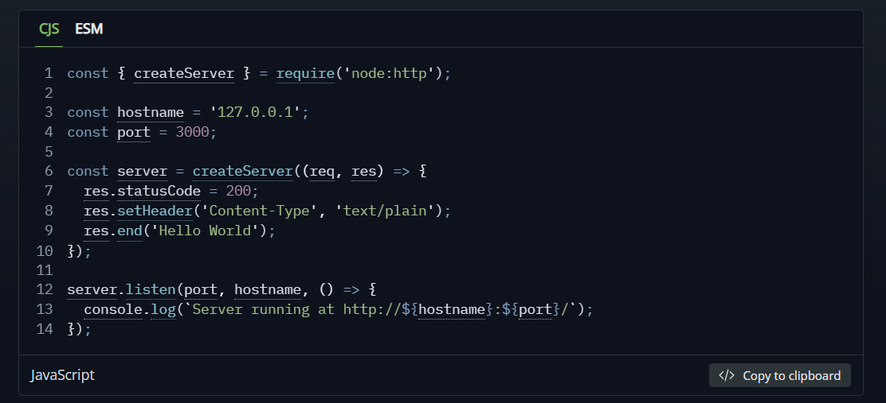

# Node JS Learning

## Day 1

Learnt the first page of original documentation of node.js . 

## Day 2

Learning the first module or code example or server or api example. 

## Day 3

We have learnt 2 new pages of Node.js Documentation 
and come to know that there are following differences in node and browser
Node.js

## Node.js vs Browser JavaScript – Key Differences

Both environments run **JavaScript** (same language, same V8 engine in most cases), but the **runtime**, **APIs**, **purpose** and **constraints** are very different.

| #  | Feature / Aspect                  | Node.js (Server-side)                              | Browser (Client-side)                              |
|----|-----------------------------------|-----------------------------------------------------|-----------------------------------------------------|
| 1  | **Execution Environment**         | Server / local machine / container                  | Web browser (Chrome, Firefox, Safari, etc.)        |
| 2  | **Main Purpose**                  | Backend, APIs, CLI tools, scripts, servers          | Frontend UI, DOM manipulation, user interaction    |
| 3  | **Global Object**                 | `global`                                            | `window` (also `self`, `globalThis`)               |
| 4  | **DOM / Window / Document**       | Not available                                       | Available (core part of the platform)              |
| 5  | **File System Access**            | Yes (`fs`, `path`, streams, etc.)                   | No (except very limited File System Access API)    |
| 6  | **Direct Network / Server**       | Yes (TCP, UDP, HTTP/HTTPS server, WebSockets, etc.) | Restricted (mostly `fetch`, `WebSocket`, no raw TCP) |
| 7  | **Module System (2025–2026)**     | Both CommonJS (`require`) **and** ESM (`import`)    | Mostly ESM (`import` / `<script type="module">`)   |
| 8  | **Package Management**            | npm / pnpm / yarn / bun — full control              | CDN, bundlers (Vite, esbuild, webpack), import maps|
| 9  | **Environment Control**           | You decide version & OS                             | You don't control user's browser/version           |
| 10 | **Security Model**                | Full system access (dangerous if not careful)       | Strong sandbox + same-origin policy + permissions |
| 11 | **Standard Web APIs**             | Missing most (no `fetch` until recent versions, no `localStorage`, no `alert`, no `setTimeout` polyfill needed) | Full set: fetch, localStorage, IndexedDB, Canvas, WebRTC, Web Workers, etc. |
| 12 | **Performance Characteristics**   | Single-threaded event loop + worker threads         | Single-threaded event loop + Web Workers           |
| 13 | **Typical I/O Handling**          | Non-blocking I/O optimized for thousands of connections | Event-driven, mostly user & network events         |
| 14 | **console.log destination**       | Terminal / log files / systemd                      | Browser DevTools console                           |
| 15 | **process / OS information**      | Yes (`process.env`, `process.argv`, `os`, `cpu`, etc.) | Very limited / none                                |
| 16 | **Best For (2025–2026)**          | REST/GraphQL APIs, real-time (Socket.io), SSR, tools, scripts, microservices | Interactive UIs, SPAs, PWAs, games, visualizations |

## V8 JavaScript Engine
- V8 is the JavaScript engine i.e. it parses and executes JavaScript code.

## Other JavaScript Engines
- Firefox has SpiderMonkey 
- Safari -> JavaScriptCore(Nitro)
- Edge -> Chakra(old), Now -> `Chromium + V8` 

## Day 6 

I made a first project file manager cli. It is an automation script that can read files list files and give data.